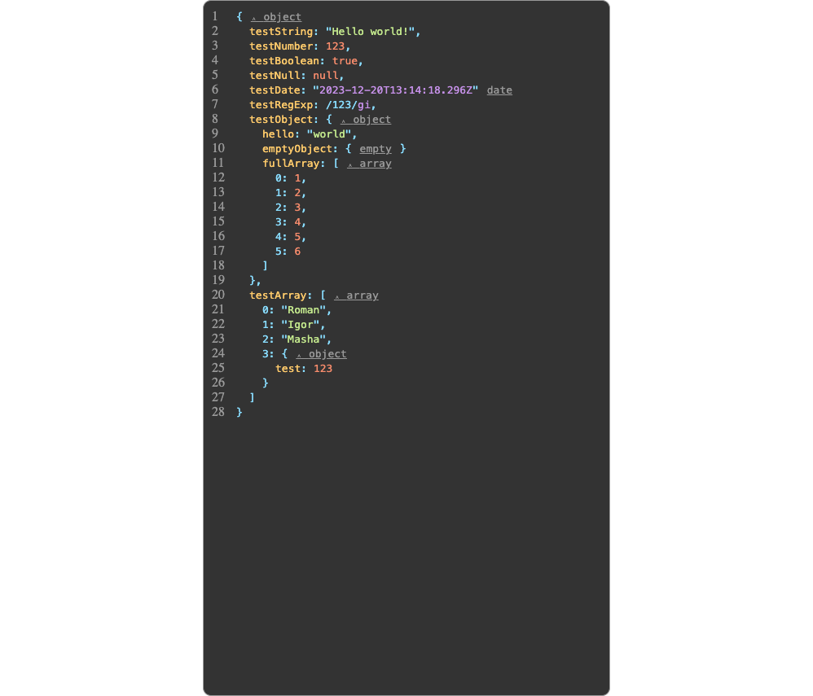
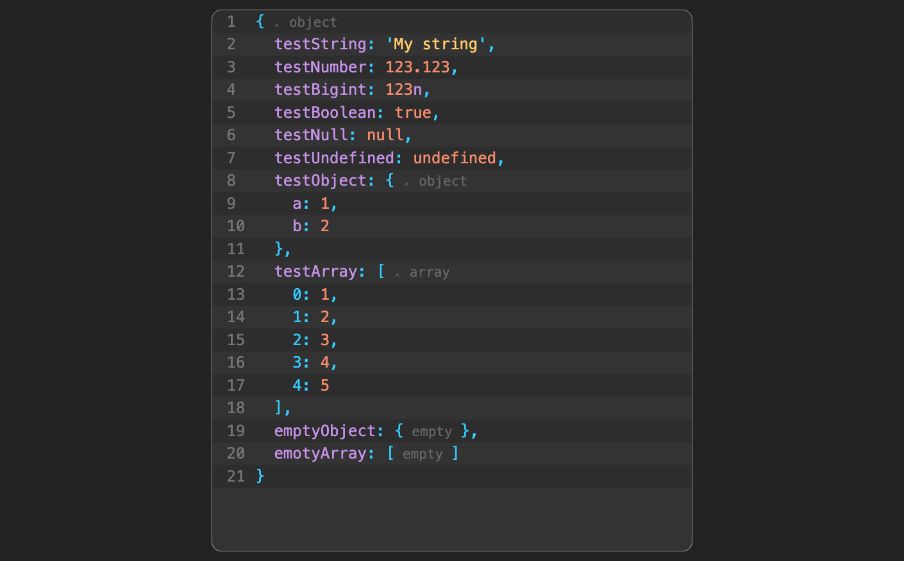

# Простой просмоторщик данных

## Скрины
>
> 
>
> 
>

## Пример использования
```tsx
import {JsonViewer} from "components/JsonViewer";

<JsonViewer data={objectForView} />

```

## Для разработки
```bash
> npm i
> npm run dev
```

## Для запуска
```bash
> npm i
> npm run build
> npm run preview
```