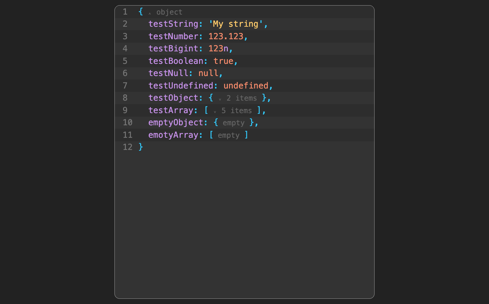

# Простой просмоторщик данных

Реализация просмотра данных в React. Реализацию можно посмотреть на [стриме](https://www.youtube.com/watch?v=p-4uUrnRiek). Демо, где можно потыкать, разместил [тут](https://vicimpa.github.io/data-viewer/)

## Скрины
>
> 
>
> 
>

## Пример использования
```tsx
import { DataViewer } from "components/DataViewer";

<DataViewer data={objectForView} />

```

## Для разработки
```bash
> npm i
> npm run dev
```

## Для запуска
```bash
> npm i
> npm run build
> npm run preview
```